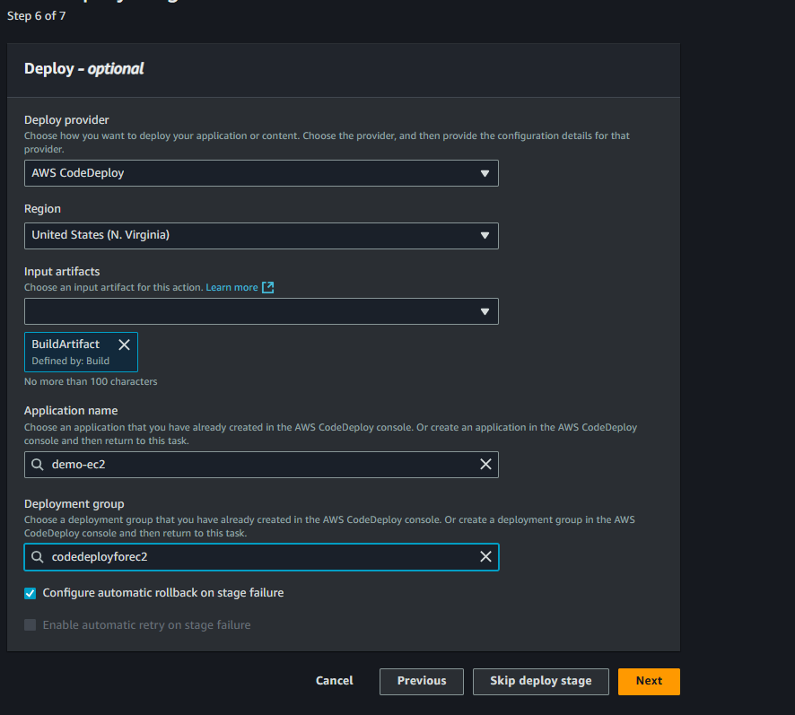

#=======================================================================================================

## Steps to execute the project

1. Create IAM Role for EC2 and AWS CodeDeploy

1.1 Creata a role and name as EC2RoleForS3 and attach a AmazonS3ReadOnlyAccess


1.2  Create a role and name ass CodeDeployRole and attach a AWSCodeDeployRole


2. Create EC2 Instance and Attach that EC2RoleForS3 in actions --> security --> modify IAM Role


Launch the instance and install the code deploy agent with below commands

```sudo yum update
sudo yum install ruby
sudo yum install wget
wget https://aws-codedeploy-us-east-1.s3.amazonaws.com/latest/install
chmod +x ./install
sudo ./install auto
```


3. aws codepipeline following steps:

CodePipeline

- Step 1: select Build custome pipeline and click next.
- step 2: choose pipeline settings

          Pipeline name - react-pipeline1
          Service role - new service role
          Role name - AWSCodePipelineServiceRole-us-east-1-react-pipeline1
          click on next


          
- step 3: Add source stage

          Source provider - GitHub (via GitHub App)
          Connection - here connect to your github profile to pull your repo
          Repository name - Saiprasad-1727/codepipeline-demo-project 
          default branch - main
          
          click on next


- step 4: Add build stage

          Build provider - Other build providers / AWS CodeBuild
          Project name - create a  project

                            Create build project 

                            Project configuration :-

                            Project name - demo-react-build-project
                            Project type - default project
                            Build specifications - Use a buildspec file ( buildsepc.yml file contains in the repo https://github.com/Saiprasad-1727/codepipeline-demo-project/blob/main/buildspec.yml)

                            Continue to CodePipeline


          click on next


- step 5: Add test stage ( this was optional so skipped this stage)                 


- step 6: Add deploy stage

          Deploy provider - AWS CodeDeploy

          Application name - 
          
          create a applicatoion and deployment group in code deploy service before adding into this


           
           

           Deployment group name - code-deploy-for -ec2
           Service role - Add your role which was created in the step 1 CodeDeployRole
           Environment Configuration - Add your EC2 name like below

   

           uncheck the load balance as it was demo project for practise purpose

          create deployment group

   

  


          CLICk ON NEXT

##  the final pipeline need to validate and verify before creating pipeline


## if you are facing the same error


here some permissions are missing that we need to add in the IAM service as shown in the below


- click on add permission -> create inline policy --> select policy editor as JSON and enter the script as shown in below

  
        {
		"Version": "2012-10-17",
		"Statement": [
		{
			"Effect": "Allow",
			"Action": [
				"codedeploy:GetApplicationRevision"
			],
			"Resource": [
				"arn:aws:codedeploy:us-east-1:920373000485:application:demo-ec2"
			]
		}
		]
		}


--------------------
appspec.yml
--------------------

version: 0.0
os: linux
files:
  - source: /
    destination: /home/ec2-user/server
hooks:
  AfterInstall:
    - location: afterinstall.sh
      timeout: 300
  ApplicationStart:
    - location: applicationstart.sh
      timeout: 300

--------------------
afterinstall.sh
--------------------

#!/bin/bash

cd /home/ec2-user/server
curl -sL https://rpm.nodesource.com/setup_14.x | sudo -E bash -
yum -y install nodejs npm


#Remove Unused Code

rm -rf node_modules
rm -rf build

#Install node_modules & Make Build and install PM2

npm -f install
npm run build
npm install -g pm2


--------------------
applicationstart.sh
--------------------

#!/bin/bash

cd /home/ec2-user/server
sudo pm2 delete Frontend
sudo pm2 start server.js --name Frontend

#=======================================================================================================

